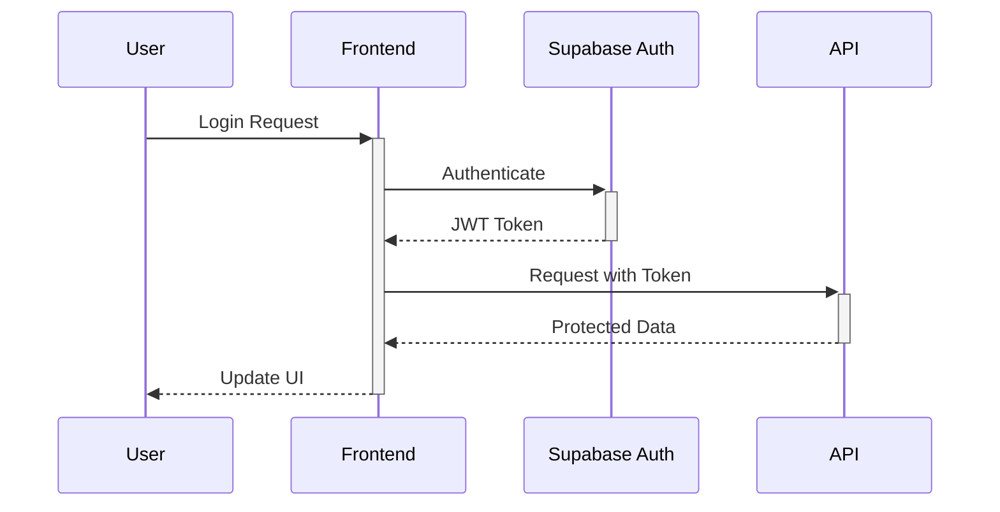
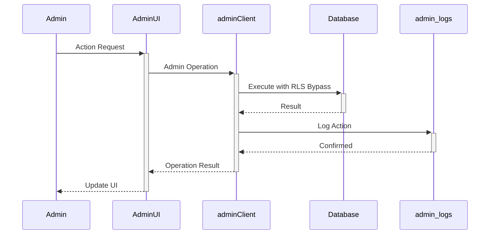
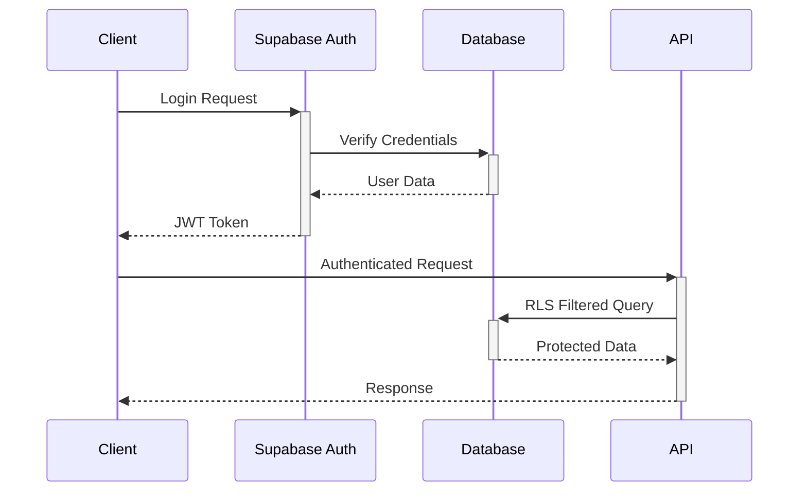
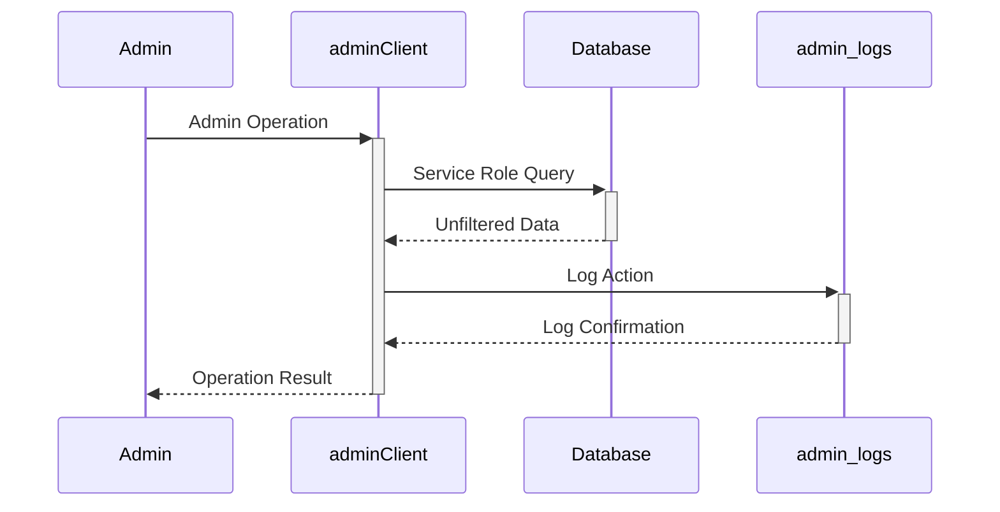

# Documentação Estrutural do HomeGuardian

## Índice
1. [Visão Geral](#visão-geral)
2. [Estrutura do Projeto](#estrutura-do-projeto)
3. [Frontend](#frontend)
   - [Páginas Públicas](#páginas-públicas)
   - [Área do Cliente](#área-do-cliente)
   - [Área Administrativa](#área-administrativa)
4. [Componentes](#componentes)
5. [Integrações](#integrações)
6. [Autenticação e Autorização](#autenticação-e-autorização)
7. [Estilização](#estilização)
8. [Utilitários](#utilitários)
9. [Hooks Personalizados](#hooks-personalizados)
10. [Tipos e Interfaces](#tipos-e-interfaces)

## Visão Geral

O HomeGuardian é uma aplicação web moderna para gestão de condomínios, construída com React, TypeScript e Supabase. O projeto utiliza uma arquitetura baseada em componentes com foco em segurança, usabilidade e manutenibilidade.

### Tecnologias Principais
- **Frontend**: React 18+ com TypeScript
- **Estilização**: TailwindCSS com shadcn/ui
- **Backend**: Supabase (PostgreSQL + APIs)
- **Autenticação**: Supabase Auth
- **Deploy**: Netlify
- **Gerenciamento de Estado**: React Context + Hooks
- **Roteamento**: React Router v6

## Estrutura do Projeto

```
/
├── src/                    # Código fonte principal
│   ├── components/         # Componentes React reutilizáveis
│   ├── pages/             # Páginas da aplicação
│   ├── hooks/             # Hooks personalizados
│   ├── utils/             # Funções utilitárias
│   ├── types/             # Definições de tipos TypeScript
│   ├── integrations/      # Integrações com serviços externos
│   └── lib/               # Bibliotecas e configurações
├── public/                # Arquivos estáticos
├── conhecimento/          # Documentação do projeto
└── supabase/             # Configurações do Supabase
```

### Integrações

#### Supabase
- `src/lib/supabase/`
  - `client.ts` - Cliente público para operações autenticadas do usuário
  - `adminClient.ts` - Cliente administrativo com permissões elevadas
  - `types.ts` - Definições de tipos e interfaces do banco de dados

### Páginas
- `src/pages/`
  - `Index.tsx` - Página inicial pública
  - `Login.tsx` - Autenticação de usuários
  - `Register.tsx` - Registro de novos usuários
  - `client/` - Dashboard do cliente
  - `admin/` - Dashboard administrativo

### Componentes

#### UI Base (`src/components/ui/`)
Componentes reutilizáveis baseados em shadcn/ui:

**Formulários e Entrada**
- `input.tsx` - Campo de entrada básico
- `form.tsx` - Componente de formulário com validação
- `textarea.tsx` - Campo de texto multilinha
- `checkbox.tsx` - Caixa de seleção
- `radio-group.tsx` - Grupo de opções exclusivas
- `select.tsx` - Menu de seleção dropdown
- `input-otp.tsx` - Entrada para código OTP

**Navegação e Layout**
- `navigation-menu.tsx` - Menu de navegação principal
- `sidebar/` - Componentes da barra lateral
- `breadcrumb.tsx` - Navegação hierárquica
- `pagination.tsx` - Controles de paginação
- `tabs.tsx` - Organização em abas

**Feedback e Overlays**
- `toast.tsx` - Notificações temporárias
- `dialog.tsx` - Modais e diálogos
- `alert.tsx` - Mensagens de alerta
- `alert-dialog.tsx` - Diálogos de confirmação
- `drawer.tsx` - Painel lateral deslizante
- `tooltip.tsx` - Dicas contextuais

**Visualização de Dados**
- `table.tsx` - Tabelas de dados
- `chart.tsx` - Gráficos e visualizações
- `carousel.tsx` - Carrossel de conteúdo
- `VideoPlayer.tsx` - Player de vídeo personalizado

**Cards e Containers**
- `card.tsx` - Container estilizado
- `ServiceCard.tsx` - Card para serviços
- `TestimonialCard.tsx` - Card para depoimentos
- `ProcessStep.tsx` - Etapa de processo

#### Cliente (`src/components/client/`)
- `ClientNavbar.tsx` - Barra de navegação do cliente
- `ClientSidebar.tsx` - Barra lateral do cliente
- `ClientContent.tsx` - Container principal de conteúdo
- `sections/` - Seções específicas do dashboard do cliente

#### Admin (`src/components/admin/`)
- `AdminSidebar.tsx` - Barra lateral administrativa
- `AdminContent.tsx` - Container principal administrativo
- `sections/` - Seções específicas do dashboard admin

### Sistema de Autenticação
Implementação com Supabase Auth:
- Suporte para múltiplos provedores
- Validação de formulários com React Hook Form
- Proteção de rotas com middleware

### Dashboards

#### Cliente
- Interface personalizada para usuários finais
- Gerenciamento de serviços e agendamentos
- Histórico de atendimentos
- Chat em tempo real

#### Administrativo
- Gestão de usuários e permissões
- Monitoramento de atividades
- Relatórios e análises
- Configurações do sistema

### Fluxos de Dados

#### Autenticação


#### Operações Administrativas


### Segurança e Permissões

#### Níveis de Acesso
1. **Anônimo**
   - Acesso a páginas públicas
   - Registro e login

2. **Autenticado**
   - Dashboard do cliente
   - Gerenciamento de perfil
   - Serviços contratados

3. **Administrativo**
   - Dashboard admin
   - Gestão de usuários
   - Configurações do sistema

#### Políticas RLS
Exemplos de políticas implementadas:

```sql
-- Usuários só podem ver seus próprios dados
CREATE POLICY "Users can view own data" ON "public"."profiles"
  FOR SELECT
  USING (auth.uid() = id);

-- Admins podem gerenciar todos os registros
CREATE POLICY "Admins have full access" ON "public"."profiles"
  USING (auth.jwt() ->> 'role' = 'admin');
```

#### Validação e Auditoria
- Validação de dados em múltiplas camadas
- Log de ações administrativas
- Monitoramento de atividades suspeitas
- Backup e recuperação de dados

## Frontend

### Páginas Públicas

#### 1. Página Inicial (src/pages/Home.tsx)
- **Objetivo**: Apresentação do sistema e captação de leads
- **Componentes Principais**:
  - `HeroSection`: Banner principal com call-to-action
  - `FeaturesSection`: Lista de funcionalidades
  - `TestimonialsSection`: Depoimentos de clientes
  - `ContactSection`: Formulário de contato
- **Funcionalidades**:
  - Navegação responsiva
  - Formulário de contato integrado com `contact_submissions`
  - Animações de scroll
  - SEO otimizado

#### 2. Página de Login (src/pages/auth/Login.tsx)
- **Funcionalidades**:
  - Login com email/senha
  - Login com magic link
  - Recuperação de senha
  - Redirecionamento inteligente
- **Validações**:
  - Formato de email
  - Força da senha
  - Captcha em tentativas repetidas

#### 3. Página de Registro (src/pages/auth/Register.tsx)
- **Campos**:
  - Nome completo
  - Email
  - Senha
  - Confirmação de senha
  - Telefone (opcional)
- **Processo**:
  1. Validação dos dados
  2. Criação do usuário no auth.users
  3. Criação do perfil em public.profiles
  4. Envio de email de confirmação

### Área do Cliente

#### 1. Dashboard do Cliente (src/pages/client/Dashboard.tsx)
- **Componentes**:
  - `WelcomeCard`: Saudação personalizada
  - `NotificationsPanel`: Notificações do usuário
  - `QuickActions`: Ações rápidas comuns
- **Funcionalidades**:
  - Visão geral das atividades
  - Acesso rápido a funções principais
  - Notificações em tempo real

#### 2. Chat (src/pages/client/Chat.tsx)
- **Estrutura**:
  - Lista de conversas
  - Área de mensagens
  - Input de nova mensagem
- **Funcionalidades**:
  - Chat em tempo real
  - Suporte a grupos
  - Envio de arquivos
  - Indicador de digitação
- **Tabelas Relacionadas**:
  - `chat_conversations`
  - `chat_messages`

#### 3. Perfil (src/pages/client/Profile.tsx)
- **Campos Editáveis**:
  - Nome completo
  - Telefone
  - Preferências de notificação
- **Segurança**:
  - Alteração de senha
  - Histórico de login
  - Dispositivos conectados

### Área Administrativa

#### 1. Dashboard Admin (src/pages/admin/Dashboard.tsx)
- **Métricas**:
  - Usuários ativos
  - Mensagens trocadas
  - Tickets abertos
  - Atividades recentes
- **Gráficos**:
  - Crescimento de usuários
  - Engajamento no chat
  - Distribuição de ações

#### 2. Gestão de Usuários (src/pages/admin/Users.tsx)
- **Funcionalidades**:
  - Lista de usuários
  - Filtros avançados
  - Ações em lote
  - Exportação de dados
- **Ações Disponíveis**:
  - Criar usuário
  - Editar perfil
  - Desativar/Ativar
  - Redefinir senha

#### 3. Logs do Sistema (src/pages/admin/Logs.tsx)
- **Informações Registradas**:
  - Timestamp
  - Ação realizada
  - Usuário responsável
  - Detalhes da ação
- **Tabela**: `admin_logs`
- **Funcionalidades**:
  - Filtros por data/ação
  - Exportação
  - Detalhamento de eventos

## Componentes

### 1. Layout (src/components/layout/)
- **MainLayout.tsx**: Layout principal com:
  - Navbar responsiva
  - Sidebar customizada
  - Footer
- **AuthLayout.tsx**: Layout para páginas de autenticação
- **AdminLayout.tsx**: Layout específico para área admin

### 2. UI (src/components/ui/)
Componentes base do shadcn/ui customizados:
- Button
- Input
- Card
- Dialog
- Table
- Toast
- Dropdown
- Avatar

### 3. Forms (src/components/forms/)
- **ContactForm**: Formulário de contato
- **ProfileForm**: Edição de perfil
- **SearchForm**: Busca universal

### 4. Chat (src/components/chat/)
- **ConversationList**: Lista de conversas
- **MessageBubble**: Mensagem individual
- **ChatInput**: Input com emojis e anexos
- **ParticipantsList**: Lista de participantes

## Integrações

### 1. Supabase (src/integrations/supabase/)

#### Estrutura de Arquivos
```
src/integrations/supabase/
├── client.ts           # Cliente Supabase principal
├── adminClient.ts      # Cliente Supabase com permissões administrativas
├── types.ts           # Tipos gerados automaticamente
└── types.d.ts         # Declarações de tipos
```

#### Cliente Principal (client.ts)
```typescript
import { createClient } from '@supabase/supabase-js';
import type { Database } from './types';

const SUPABASE_URL = "https://cburpyzmvdgypjjdpoup.supabase.co";
const SUPABASE_PUBLISHABLE_KEY = "..."; // Chave anônima para operações públicas

export const supabase = createClient<Database>(SUPABASE_URL, SUPABASE_PUBLISHABLE_KEY);
```

#### Cliente Administrativo (adminClient.ts)
```typescript
import { createClient } from '@supabase/supabase-js';
import type { Database } from './types';

const SUPABASE_URL = "https://cburpyzmvdgypjjdpoup.supabase.co";
const SUPABASE_SERVICE_ROLE_KEY = "..."; // Chave de serviço para operações administrativas

export const supabaseAdmin = createClient<Database>(
  SUPABASE_URL,
  SUPABASE_SERVICE_ROLE_KEY
);
```

#### Tipos Gerados (types.ts)
- Tipos gerados automaticamente pelo Supabase CLI
- Definições completas das tabelas do banco
- Tipagem forte para queries e mutations
- Interfaces para relacionamentos

### 2. Estrutura de Páginas

#### Páginas Principais (src/pages/)
```
src/pages/
├── Index.tsx              # Página inicial (1.8KB)
├── Login.tsx              # Página de login (7.1KB)
├── Register.tsx           # Página de registro (994B)
├── ForgotPassword.tsx     # Recuperação de senha (1.0KB)
├── AdminDashboard.tsx     # Dashboard administrativo (1.7KB)
├── ClientDashboard.tsx    # Dashboard do cliente (1.5KB)
└── NotFound.tsx           # Página 404 (3.5KB)
```

#### Sistema de Autenticação (Login.tsx)
- Implementação completa de login com Supabase Auth
- Suporte a múltiplos provedores
- Validação de formulários
- Gestão de estado de autenticação
- Redirecionamento baseado em roles

#### Dashboards
1. **Cliente (ClientDashboard.tsx)**
   - Interface personalizada por usuário
   - Integração com serviços em tempo real
   - Componentes de visualização de dados
   - Gestão de estado local

2. **Admin (AdminDashboard.tsx)**
   - Métricas e KPIs
   - Gestão de usuários
   - Logs do sistema
   - Ações administrativas

### 3. Fluxos de Dados

#### Autenticação


#### Operações Administrativas


### 4. Segurança e Permissões

#### Níveis de Acesso
1. **Anônimo** (SUPABASE_PUBLISHABLE_KEY)
   - Registro
   - Login
   - Conteúdo público

2. **Autenticado** (JWT Token)
   - Perfil próprio
   - Chat
   - Funcionalidades básicas

3. **Administrativo** (SUPABASE_SERVICE_ROLE_KEY)
   - Gestão de usuários
   - Logs do sistema
   - Operações privilegiadas

#### Políticas de Segurança
1. **RLS (Row Level Security)**
   ```sql
   -- Exemplo de política para profiles
   CREATE POLICY "Usuários podem ver seu próprio perfil"
   ON public.profiles
   FOR SELECT
   USING (auth.uid() = id);
   ```

2. **Validação de Dados**
   ```typescript
   // Exemplo de validação no frontend
   const validateProfile = (data: ProfileData) => {
     if (!data.email.includes('@')) throw new Error('Email inválido');
     if (data.phone && !/^\+?[\d\s-]+$/.test(data.phone)) 
       throw new Error('Telefone inválido');
   };
   ```

3. **Auditoria**
   ```typescript
   // Exemplo de logging administrativo
   const logAdminAction = async (action: string, details: any) => {
     await supabaseAdmin
       .from('admin_logs')
       .insert({
         action,
         performed_by: currentUser.id,
         details
       });
   };
   ```

## Autenticação e Autorização

### 1. Contexto de Auth (src/contexts/AuthContext.tsx)
- Gerenciamento de sessão
- Refresh token automático
- Persistência de estado
- Controle de rotas protegidas

### 2. Middleware de Autorização
- Verificação de roles
- Redirecionamentos
- Cache de permissões

### 3. Políticas de Segurança
- RLS em tabelas sensíveis
- Validação de tokens
- Rate limiting
- Proteção contra XSS

## Estilização

### 1. TailwindCSS
- Temas customizados
- Componentes responsivos
- Dark mode
- Animações

### 2. Design System
- Cores corporativas
- Tipografia consistente
- Espaçamentos padronizados
- Componentes reutilizáveis

## Utilitários

### 1. Formatadores (src/utils/formatters.ts)
- Datas
- Moedas
- Telefones
- URLs

### 2. Validadores (src/utils/validators.ts)
- Campos de formulário
- Senhas
- Documentos
- Permissões

### 3. Helpers (src/utils/helpers.ts)
- Manipulação de arrays
- Transformação de dados
- Cache local
- Debounce/Throttle

## Hooks Personalizados

### 1. useAuth
- Login/Logout
- Verificação de sessão
- Refresh token
- Permissões

### 2. useChat
- Conexão websocket
- Cache de mensagens
- Gestão de estado
- Notificações

### 3. useForm
- Validação
- Submissão
- Estado do form
- Feedback visual

## Tipos e Interfaces

### 1. Database Types (src/types/supabase.ts)
- Gerados automaticamente
- Tipagem forte
- Relacionamentos
- Enums

### 2. Component Props (src/types/props.ts)
- Interfaces de componentes
- Types utilitários
- Generics
- Constants

### 3. API Responses (src/types/api.ts)
- Estruturas de resposta
- Error types
- Payloads
- DTOs

## Considerações de Performance

### 1. Otimizações
- Code splitting
- Lazy loading
- Memoização
- Virtualização

### 2. Caching
- React Query
- Service Worker
- Local Storage
- Memory Cache

### 3. Monitoramento
- Error tracking
- Performance metrics
- User analytics
- Log aggregation

## Segurança

### 1. Frontend
- CSRF protection
- XSS prevention
- Content Security Policy
- Secure Headers

### 2. API
- Rate limiting
- Input validation
- Token validation
- Error handling

### 3. Database
- RLS policies
- Encrypted data
- Audit logs
- Backups

## Deploy e CI/CD

### 1. Netlify
- Automatic deploys
- Environment variables
- Build optimization
- Edge functions

### 2. Build Process
- TypeScript compilation
- Asset optimization
- Code minification
- Cache invalidation

### 3. Monitoring
- Error tracking
- Performance monitoring
- User analytics
- Status page 