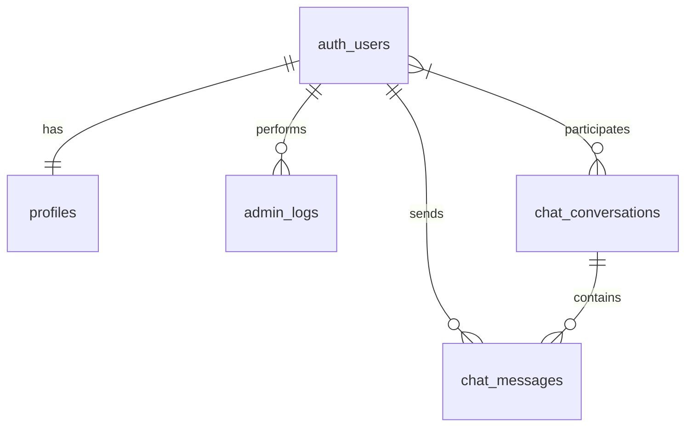

# Documentação do Banco de Dados - HomeGuardian

## Índice
1. [Visão Geral](#visão-geral)
2. [Schemas](#schemas)
3. [Tabelas](#tabelas)
4. [Autenticação](#autenticação)
5. [Políticas de Segurança (RLS)](#políticas-de-segurança)
6. [Funções e Triggers](#funções-e-triggers)
7. [Relacionamentos](#relacionamentos)
8. [Índices](#índices)
9. [Backup e Manutenção](#backup-e-manutenção)

## Visão Geral

O banco de dados do HomeGuardian é construído sobre o PostgreSQL, utilizando a plataforma Supabase para gerenciamento e funcionalidades adicionais. A estrutura é projetada para suportar um sistema de gerenciamento de condomínios, com foco em segurança, comunicação e administração.

### Tecnologias Principais
- PostgreSQL: Sistema de banco de dados principal
- Supabase: Plataforma de desenvolvimento com recursos adicionais
- PostgREST: API RESTful automática
- GoTrue: Serviço de autenticação

## Schemas

### 1. Public
Schema principal que contém as tabelas de negócio da aplicação.

### 2. Auth
Schema gerenciado pelo Supabase para autenticação e autorização.

### 3. Storage
Schema para gerenciamento de arquivos e mídia.

### 4. Realtime
Schema para funcionalidades de tempo real.

## Tabelas

### 1. Profiles (public.profiles)
Tabela que armazena informações adicionais dos usuários.

#### Estrutura
| Coluna      | Tipo                    | Nullable | Default | Descrição                                    |
|-------------|-------------------------|----------|---------|----------------------------------------------|
| id          | uuid                    | NO       | -       | Chave primária, referência a auth.users      |
| updated_at  | timestamp with timezone | YES      | now()   | Data da última atualização                   |
| created_at  | timestamp with timezone | YES      | now()   | Data de criação                              |
| full_name   | text                    | YES      | -       | Nome completo do usuário                     |
| role        | text                    | YES      | 'user'  | Papel do usuário (user, admin)               |
| email       | text                    | YES      | -       | Email do usuário                             |
| phone       | text                    | YES      | -       | Telefone do usuário                          |

#### Políticas de Segurança (RLS)
1. "Usuários podem ver seu próprio perfil"
   ```sql
   CREATE POLICY "Usuários podem ver seu próprio perfil" ON public.profiles
   FOR SELECT USING (
     auth.uid() = id OR 
     EXISTS (
       SELECT 1 FROM auth.users 
       WHERE id = auth.uid() 
       AND raw_app_meta_data->>'role' = 'admin'
     )
   );
   ```

2. "Usuários podem atualizar seu próprio perfil"
   ```sql
   CREATE POLICY "Usuários podem atualizar seu próprio perfil" ON public.profiles
   FOR UPDATE USING (
     auth.uid() = id
   ) WITH CHECK (
     auth.uid() = id
   );
   ```

3. "Perfis são criados automaticamente"
   ```sql
   CREATE POLICY "Perfis são criados automaticamente" ON public.profiles
   FOR INSERT WITH CHECK (
     auth.uid() = id
   );
   ```

#### Relacionamentos
- `id` → `auth.users(id)`: Relacionamento 1:1 com a tabela de usuários do auth

### 2. Admin Logs (public.admin_logs)
Tabela que registra todas as ações administrativas no sistema.

#### Estrutura
| Coluna       | Tipo                    | Nullable | Default | Descrição                               |
|--------------|-------------------------|----------|---------|------------------------------------------|
| id           | uuid                    | NO       | gen_random_uuid() | Identificador único do log    |
| created_at   | timestamp with timezone | NO       | now()   | Data e hora da ação                     |
| action       | text                    | NO       | -       | Tipo de ação realizada                  |
| performed_by | uuid                    | NO       | -       | ID do usuário que realizou a ação       |
| target_id    | uuid                    | YES      | -       | ID do objeto alvo da ação (se aplicável)|
| details      | jsonb                   | YES      | -       | Detalhes adicionais da ação em JSON     |

#### Relacionamentos
- `performed_by` → `auth.users(id)`: Usuário que realizou a ação

### 3. Chat Messages (public.chat_messages)
Tabela que armazena as mensagens de chat.

#### Estrutura
| Coluna        | Tipo                    | Nullable | Default | Descrição                            |
|---------------|-------------------------|----------|---------|---------------------------------------|
| id            | uuid                    | NO       | -       | Identificador único da mensagem       |
| conversation_id| uuid                   | NO       | -       | ID da conversa                        |
| content       | text                    | NO       | -       | Conteúdo da mensagem                  |
| created_at    | timestamp with timezone | YES      | now()   | Data e hora da mensagem               |
| sender_id     | uuid                    | NO       | -       | ID do usuário que enviou a mensagem   |

#### Relacionamentos
- `conversation_id` → `chat_conversations(id)`
- `sender_id` → `auth.users(id)`

### 4. Chat Conversations (public.chat_conversations)
Tabela que gerencia as conversas entre usuários.

#### Estrutura
| Coluna          | Tipo                    | Nullable | Default | Descrição                           |
|-----------------|-------------------------|----------|---------|--------------------------------------|
| id              | uuid                    | NO       | -       | Identificador único da conversa      |
| created_at      | timestamp with timezone | YES      | now()   | Data de criação da conversa         |
| updated_at      | timestamp with timezone | YES      | now()   | Última atualização da conversa      |
| title           | text                    | YES      | -       | Título da conversa                   |
| creator_id      | uuid                    | NO       | -       | ID do criador da conversa           |
| is_group        | boolean                 | NO       | false   | Se é uma conversa em grupo          |
| participant_ids | uuid[]                  | NO       | -       | Array com IDs dos participantes     |
| last_message    | text                    | YES      | -       | Última mensagem da conversa         |

#### Relacionamentos
- `creator_id` → `auth.users(id)`
- `participant_ids` → `auth.users(id)[]`

### 5. Contact Submissions (public.contact_submissions)
Tabela que armazena submissões do formulário de contato.

#### Estrutura
| Coluna      | Tipo                    | Nullable | Default | Descrição                              |
|-------------|-------------------------|----------|---------|----------------------------------------|
| id          | uuid                    | NO       | -       | Identificador único da submissão       |
| created_at  | timestamp with timezone | YES      | now()   | Data da submissão                      |
| name        | text                    | NO       | -       | Nome do contato                        |
| email       | text                    | NO       | -       | Email do contato                       |
| phone       | text                    | YES      | -       | Telefone do contato                    |
| subject     | text                    | NO       | -       | Assunto da mensagem                    |
| message     | text                    | NO       | -       | Conteúdo da mensagem                   |
| status      | text                    | NO       | 'new'   | Status da submissão                    |

## Autenticação

### Configuração do Auth
O sistema utiliza o serviço de autenticação do Supabase (GoTrue) com as seguintes configurações:

1. **Provedores Habilitados**
   - Email/Senha
   - Magic Link (Email sem senha)

2. **Configurações de Email**
   - Confirmação de email obrigatória
   - Template personalizado para emails de:
     - Confirmação
     - Redefinição de senha
     - Magic link
     - Convite

3. **Restrições de Senha**
   - Mínimo 8 caracteres
   - Pelo menos 1 número
   - Pelo menos 1 caractere especial

### Fluxo de Autenticação
1. **Registro de Usuário**
   ```sql
   -- Trigger que cria perfil automaticamente após registro
   CREATE FUNCTION public.handle_new_user()
   RETURNS TRIGGER AS $$
   BEGIN
     INSERT INTO public.profiles (id, email, role)
     VALUES (new.id, new.email, 'user');
     RETURN new;
   END;
   $$ LANGUAGE plpgsql SECURITY DEFINER;

   CREATE TRIGGER on_auth_user_created
     AFTER INSERT ON auth.users
     FOR EACH ROW EXECUTE FUNCTION public.handle_new_user();
   ```

## Políticas de Segurança

### Row Level Security (RLS)
Todas as tabelas importantes têm RLS ativado para garantir o acesso adequado aos dados.

1. **Profiles**
   - Usuários podem ver/editar apenas seu próprio perfil
   - Admins podem ver todos os perfis
   - Sem permissão de deleção direta

2. **Chat**
   - Usuários só podem ver/enviar mensagens em conversas das quais participam
   - Mensagens não podem ser editadas após envio
   - Deleção lógica apenas

## Funções e Triggers

### 1. Gerenciamento de Usuários
```sql
-- Função para atualizar timestamp
CREATE FUNCTION public.handle_updated_at()
RETURNS TRIGGER AS $$
BEGIN
  NEW.updated_at = now();
  RETURN NEW;
END;
$$ LANGUAGE plpgsql;

-- Trigger para atualização automática de timestamp
CREATE TRIGGER handle_updated_at
  BEFORE UPDATE ON public.profiles
  FOR EACH ROW
  EXECUTE FUNCTION public.handle_updated_at();
```

### 2. Logging
```sql
-- Função para registrar ações administrativas
CREATE FUNCTION public.log_admin_action(
  action text,
  performed_by uuid,
  target_id uuid DEFAULT NULL,
  details jsonb DEFAULT NULL
) RETURNS void AS $$
BEGIN
  INSERT INTO public.admin_logs (action, performed_by, target_id, details)
  VALUES (action, performed_by, target_id, details);
END;
$$ LANGUAGE plpgsql SECURITY DEFINER;
```

## Relacionamentos

### Diagrama de Relacionamentos


## Índices

### Índices Principais
1. **Profiles**
   - `profiles_pkey` (id)
   - `profiles_email_idx` (email)

2. **Admin Logs**
   - `admin_logs_pkey` (id)
   - `admin_logs_created_at_idx` (created_at)
   - `admin_logs_performed_by_idx` (performed_by)

3. **Chat**
   - `chat_messages_pkey` (id)
   - `chat_messages_conversation_id_idx` (conversation_id)
   - `chat_conversations_pkey` (id)
   - `chat_conversations_participant_ids_idx` (participant_ids)

## Backup e Manutenção

### Estratégia de Backup
1. **Backups Automáticos**
   - Backup completo diário
   - Retenção de 7 dias
   - Armazenamento em região redundante

2. **Point-in-Time Recovery**
   - Habilitado
   - Retenção de 24 horas

### Manutenção
1. **Vacuum**
   - Automático quando necessário
   - Threshold: 20% de tuplas mortas

2. **Analyze**
   - Executado automaticamente após grandes modificações
   - Atualização de estatísticas para otimização de queries

## Notas de Implementação

### Boas Práticas
1. Sempre usar transações para operações múltiplas
2. Implementar soft delete quando apropriado
3. Usar prepared statements para evitar SQL injection
4. Manter índices atualizados baseado no uso

### Monitoramento
1. Logs de performance no Supabase Dashboard
2. Alertas configurados para:
   - Uso de CPU acima de 80%
   - Conexões acima de 80%
   - Erros de autenticação em sequência

### Segurança
1. Todos os segredos gerenciados pelo Vault
2. Conexões sempre via SSL/TLS
3. RLS ativo em tabelas sensíveis
4. Auditoria via admin_logs
